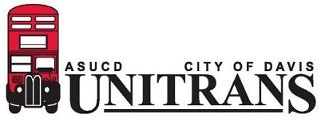
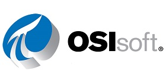
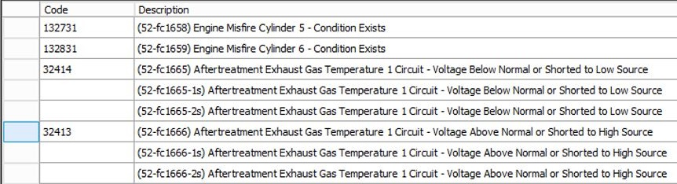
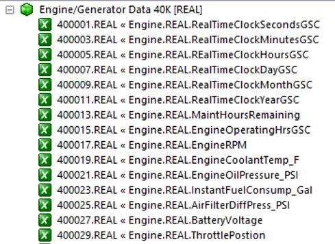
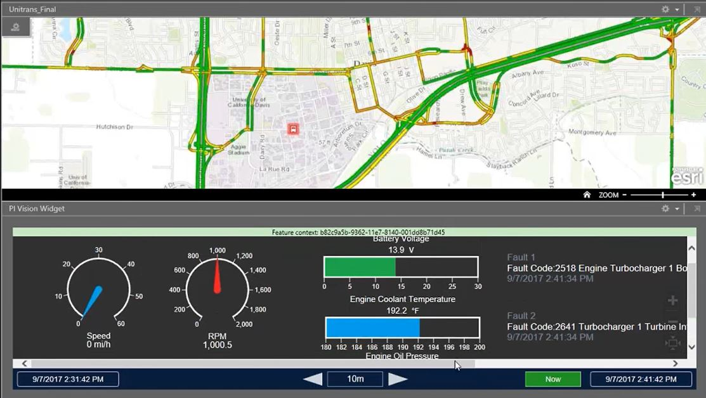
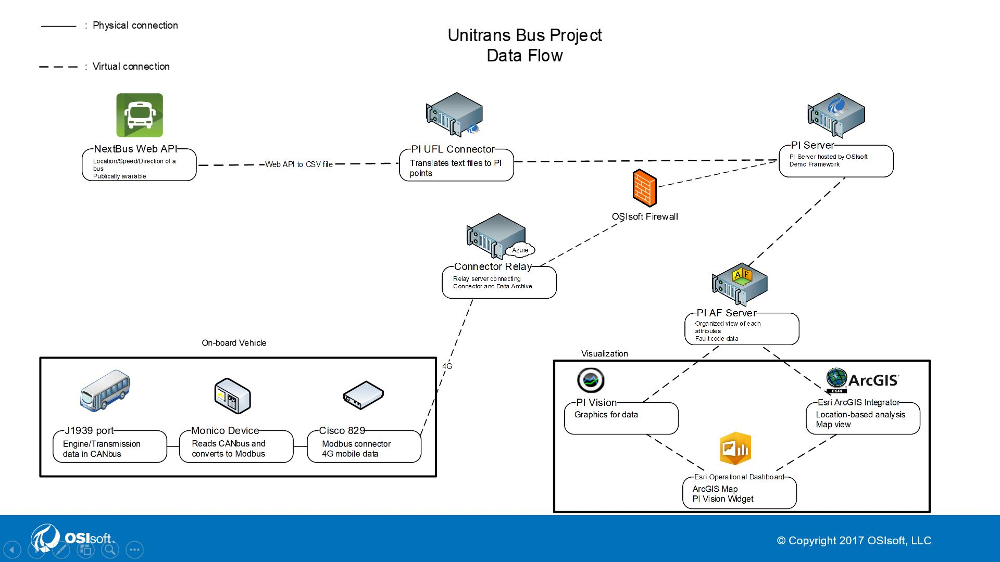

<figure>
    
</figure>

## Introduction
This is a project I did during my internship at OSIsoft in the summer of 2017. I created a system that could monitor the buses in real time, collect attributes that can help with the maintenance of the buses such as engine data, fault codes, gps, and visualize this data to help the maintenance team. This system ran even after the end of my internship as it was very useful. OSIsoft invited me to [speak at one of their user conferences](https://www.osisoft.com/Presentations/Lightning-Round-Talks--OSIsoft-Call-for-Collaboration-%E2%80%93-1st-Year-Innovation-Showcase/) called PI World in April of 2018. To this date, this is the project that I am most proud of.

## Being a bus driver
<figure>
    
</figure>
Something unique about me is that I was a part time bus driver at UC Davis for the city of Davis. Unitrans, the transit bus system at Davis, is jointly operated by the city and UC Davis, which means that all the drivers and supervisors at Unitrans are UC Davis students. Ever since the Spring Quarter of my Freshmen year until the end of my Senior year, I was a bus driver for Unitrans. By the time I graduated, I had over 1,500 hours of worktime at Unitrans. Although it was just a part time job, I always found ways to utilize my engineering background onto it. This project is where my passion for driving the bus was able to intersect with my passion for engineering.

## Company background
<figure>
    
</figure>
OSIsoft is a company that develops a software called the PI System for data management. It has the ability to take in data from multiple different sources and convert them to a uniform datatype. It is useful to monitor and analyze data from data sources that are usually difficult to compare. Its biggest customers are industrial companies. For example, 100% of nuclear plants in the US uses PI System. It also has a presence in many universities. For example, all the building data from UC Davis goes through the PI System. PI System also has the ability to visualize the data through one of OSIsoft's other software called PI Vision. As a Customer Support Engineer Intern, I was given an opportunity to use OSIsoft's software for my own project.

## Project background
To get an idea of my project goals, I made a visit to Davis, where I met with Andy Wyly, the Unitrans Maintenance Manager, and asked him what the biggest problem is to the company. He said that there were 142 road service calls over the ~50 bus fleet in 2016. A road call is when a bus seems to have a problem, like the fault light is on, and the maintenance crew has to drive out to the bus with a diagnostic box to check if the problem is severe. Each of these road service calls have impacted the riders with disruption of service and delays, and they could be safety incidents resulting from in-route transfers and road hazards. Most of the time, these fault codes were misfires that the drivers can just "roll with it." With this in mind, I came up with a potential solution to ehis problem. That is: Creating a dashboard with a real-time location and attributes of the bus and remotely viewing whether or not the fault light is crucial.

#### What kind of data to get
First of all, I knew that I needed to collect the fault code data, so I received a list of fault codes from Andy. Afterwards, I put that list in a table to be used as a lookup table. I also asked Andy what other parameters might be useful to be collected, and he gave me a list of parameters such as the engine oil pressure, engine coolant temperature, battery voltage, etc.
<figure>
    
</figure>

#### How to get the data
All buses have a port called J1939, which is similar to the OBC port on cars. This port is used by an autoshop when they want to retrive data from the vehicle. By data, I mean any type of data possible, from vehicle speed, battery current to engine oil temperature, engine RPM, and the list goes on. By talking to the an industry principal of OSIsoft, I was able to get help from a company called Monico Monitoring that makes a device meant to plug into the J1939 port, read the stream of data, translate into meaningful data, and store into Modbus registers. Modbus register is a way to store data. Each register holds 16 bits of information. For example, given a picture on the right, if I want to know the engine RPM, I would just look at the register 400017.
<figure>
    
</figure>

#### How to send the data
At this point, the data is just being stored on the Monico device. I needed a way to send this data online so it can access the PI Server; I needed a router. I reached out to Cisco and pitched my idea, and I was able to get a loaner device from Cisco. The device I got, IR829, is an industrial, rugged router designed to withstand heavy-duty environment, which was perfect for the bus. It also has the ability to have one of the necessary PI software installed, meaning that the Monico device could directly connect to this router and send data to the PI Server.

## Result
I used PI Vision to view the data. I was also able to get a bus's location via a publically available Web API that was using a device that all Unitrans buses have. With the location data, I was able to come up with the display like below. The map shows a map of Davis with the bus as an icon. When the bus is clicked, the attributes of the bus could be shown. This design was made with the mindset that this project could be expanded to a fleet of buses.
<figure>
    
</figure>

## Dataflow
<figure>
    
</figure>

### Legacy
During the year of this system's lifecycle, it caught about half a dozen of misfired fault lights. The number seems quite low, but it is a typical number for one bus in a year. If this system had been expanded to fleet-wide, it would've caught all the misfired fault lights. In addition to catching misfired fault lights, it was also very beneficial for the maintenance crew. There was a period of time where this bus was going through maintenance. None of the maintenance crews understood what was going on with the bus. However, I had set up a text message notification through the PI System that alerts Andy exactly what is wrong with the bus at eactly what time. Because of this, they were able to save countless number of hours. As mentioned earlier, I presented at OSIsoft's user conference. I was the only intern to have their project presented at the conference. OSIsoft had a huge presence with UC Davis, from the winery to utilities and facilities departments. Unitrans, although a huge part of UC Davis, did not have any partnership with OSIsoft. Because of my project, OSIsoft was one step closer to forming a relationship with Unitrans. On a more personal level, this project helped shape the person I am today. Because of this project, I became closer to an ECE professor who works closely with OSIsoft. Impressed by my work, he linked me to the folks at the [winery]({{site.url}}/winery/), where I did my internship the following summer. In addition, when a Civil Engineering professor reached out to Andy Wyly about potentially doing an experiment on a Unitrans bus, Andy asked me to help out. This professor turned out to be the one I did the [TSP Project]({{site.url}}/c3po/) with. All in all, I am very thankful for this project and its impact to Unitrans, OSIsoft and myself.