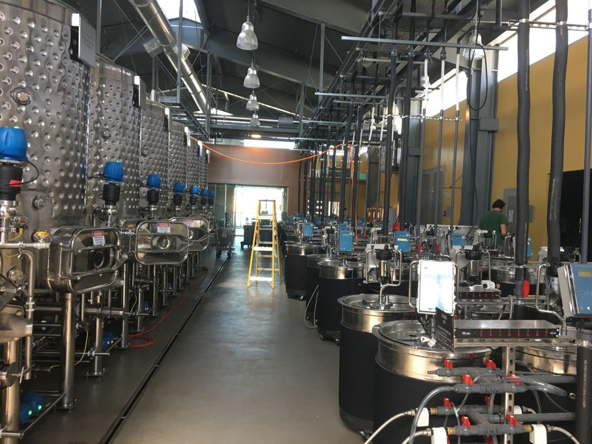
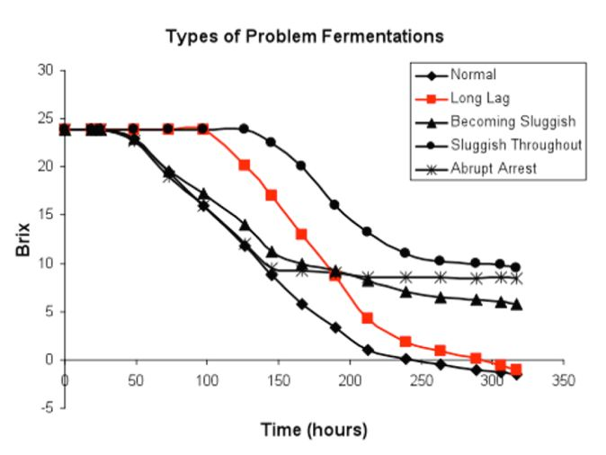
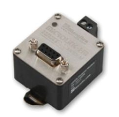
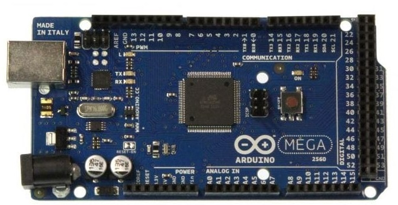
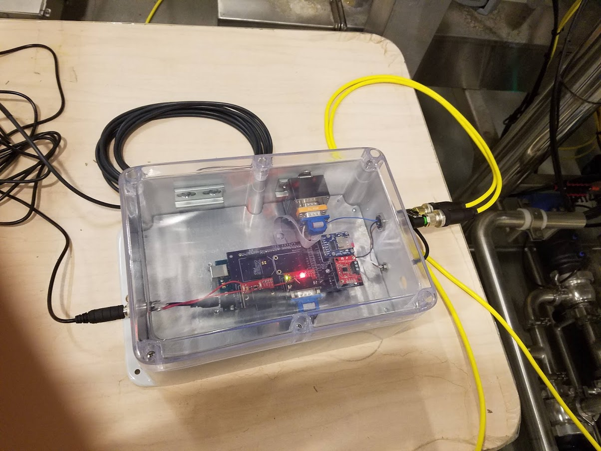
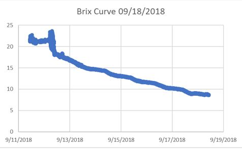

[Link to the repo](https://github.com/franklee97/UCDavis_Winery)

<figure>
    
</figure>

## Introduction
This is a project I did during the summer of 2018 when I worked as an Electrical Engineer Intern at UC Davis Robert Mondavi Institue Winery. I conceptualized, designed, and implemented an embedded system that is used to collect data from sensors mounted on one of the fermentation tanks at the winery.

## Background of UC Davis Winery
UC Davis is a well-known agriculture school, and there are many different departments that are agriculture-focused. For example, UC Davis offers courses on tractor driving, coffee brewing, beer brewing, and last but not least, winemaking. There is a winery in the campus as well as 120 acres of vineyard. The winery has 14 500-gallon fermentation tanks and 152 50-gallon fermentation tanks for research purposes. Any students at UC Davis can take a winemaking course, and it is one of the most impacted courses on campus. This building has two goals -- to build the most advanced winery in the world and the most sustainable winery in the world. This is why all 152 smaller fermentation tanks all have programmable chips that can give real time data of the fermentation. The bigger 500-gallon tanks also have holes for temperature or pressure sensor probes. There is a Programmable Logic Controller(PLC) that can control the behavior of the tanks, such as doing a pumpover, raising/lowering the temperature, and opening/closing valves to wash out the tank. Because of the winery being at a university, a lot of research is done at the winery. The wines produced here, although made by grapes outside of the school, are not for sale, as they put emphasis on researching the wine.

## Background on my research
The research that I worked with was regarding Brix and Redox potential of a fermentation tank. Brix is a measurement of sugar concentration inside a grape juice. During a fermentation, the Brix level drops as the yeast eats away the sugar, producing alcohol. This decrease in Brix is known as the Brix curve. The Brix curve is a useful diagnostic tool for winemakers as they determine the quality of the wine. A wine that went through a good fermentation has a higher quality than a wine that had failed fermentation. There are many consequences to having a bad Brix curve, which include dry and/or spoiled wine. Because Brix is a concentration measurement, it can be calculated by using two pressure sensors with different locations on the tank. Another important aspect of fermentation is the Redox potential. Redox potential is dependent on the oxygen level of the liquid. The oxygen mitigates the sulfur-based compounds in the grape juice, which means that having low oxygen might end up producing a wine that has a sulfur odor. Therefore, the objectives of my project were to measure Brix data to predict the curve using an existing equation, measure Redox potential to know when to add oxygen, and make a system that costs less than the ones on the market but is comparable in features. The Chemical Engineering professor I closely worked with developed a Brix curve prediction equation decades ago, but he didn't have the technology to implement a smart system onto a fermentation tank to view Brix in real-time. So by using my system, he could finally experiment his equation.

<figure>
    
</figure>

#### How to retrieve the data
I had a very limited materials to begin. I was given the pressure sensors and redox sensors and was asked to make the system from the scratch. I also had a limited batches of grape juice, because only few vineyards have enough grapes to fill up the big fermentation tanks. To learn how to retrive the data, I did hours of research on the sensors. I read through the datasheet for the sensors multiple times to understand how the sensor operates, and what type of electrical specifications are needed to operate the sensor. I learned that the pressure sensors use HART protocol, which is an industrial serial communication protocol that only requires two wires. Oppose to pressure sensors, the Redox sensors use Modbus protocol, which is a common serial communication protocol. Because Modbus protocol was much more prevalent, I decided to look for a device that can convert HART signals into Modbus signals. There is a device called the HART modem that could solve this problem(shown on the right). Now all my signals were uniform. To physically connect the HART modem to another device, I had to use its RS232 port, which is a physical communication scheme. Similarly, the Redox sensor used RS485 port, which is considered a more advanced RS232.
<figure>
    
</figure>

#### How to manage the data
To manage the data, I needed something that is mobile and small as the system needed to run without my supervision. I decided to use the Arduino MEGA. It is a microcontroller with multiple serial pins, which was useful since I had multiple serial communications happening at the same time. It also had the ability to add multiple modues by using its digital input/output pins. Because Arduino is widely used by everyday people, there were many public libraries and sample codes that I could reference. It was also very small in size and cheap. Using the serial pins, I could write a simple code to request data from the devices it is connected to. In addition, by using its processor, I could perform post-retrieval calculations like the arithmetic that is necessary to convert pressure measurements to Brix.
<figure>
    
</figure>

#### How to store and send the data
To store the data, I added a MicroSD card module that takes in a MicroSD card to log to a file in the card. It used a SPI communication protocol, which is a commonly used communication protocol for Arduino projects. I also added an RTC module, a Real Time Clock module. This module has a slot for a coin battery, which will keep the module running even without having an external power source. It is essential to keep an accurate time, a necessary feature at logging data that deals with time. This module uses the I2C communication protocol, another common protocol. To send the data wirelessly, I took advantage of the existing wireless network in the winery that uses the Zigbee network. Zigbee is similar to Wifi, but it uses much less power and has lower data rate and closer proximity. To join this network, I just needed to purchase an XBee module, which is a radio module for Zigbee communication. This connected to Arduino from one of its serial ports. When everything is connected, the Arduino could send data to this XBee module, and this module could send data to another XBee module that is in this Zigbee network. In addition to Zigbee, I also added a Bluetooth module, which could be used as a possible implementation in the future if I created a mobile app for this system. This Zigbee network is directly connected to the PI Server that is running at the winery. PI Server is a real-time data storage server that is developed by a company called OSIsoft(more on this company in my Unitrans Bus Project). It is a great platform to integrate multiple different data sources at once. For example, I can have data from this system as well as data from building power usage be shown in the same display. With all these in mind, I created a dataflow chart that explains how everything in my system is connected:
<figure>
    
</figure>

## Dataflow explanation
First, I have the pressure sensor. It is powered by an external power supply. The other pressure sensor is also powered by the same power supply. The HART signals that are produced by these two sensors are fed into the two HART modems, respectively. The HART modem has the ability to handle 16 devices at once, so this system can be expanded if necessary. The HART modem is connected to the RS232 module that acts as a connector between the modem and the Arduino. The other HART modem goes through the same connection. The Arduino is connected to the RS2323 module through serial ports. The Redox sensor doesn't require any data conversion, so it could directly connect to an RS485 connector to the Arduino. Additional modules are also mounted on the Arduino. Lastly, the XBee module is connected to the Arduino, which has a wireless connection to its gateway and consequently the PI Server. Most of this system were inside a closed container.

## Physical packaging
The physical packaging was surprisingly the most difficult portion of the project. I needed to come up with a design that is rugged enough to withstand the environment of the winery. This meant that it needed a waterproof casing. I ended up using a casing from a company called Polycase. The cables had to enter the box, either through a connector or a rubber gland to protect the inside from getting wet. For safety and stability purposes, I didn't want any jumper wires, which meant that I had to design a Printed Circuit Board.
<figure>
    
</figure>

## Result
The picture below shows a Brix curve generated by my system. The total cost of this system turned out to be around $1,000, which may seem a lot, but it has the ability to monitor all 14 tanks without adding any additional modules. The equivalend industrial system would cost around $5,000 to $10,000, and they may have many proprietary features and a possible "subscription" fees for using their product.
<figure>
    
</figure>

### Challenges
There were many challenges to this project. The biggest and scariest challenge was that I had a seasonal data source. I only have a limited amount of time to experiment and collect data. To solve this challenge, I prioritized logging data, even if it couldn't be done wirelessly. I also had limited resources. Developing a system like this in a winery is still a new thing in the industry, so there hasn’t been many projects in this field. To receive any help, I personally reached out to those who conducted a similar projects. Also, I have never read an article of someone trying to connect the HART modem to an Arduino. When I did the research, I knew I was able to get Modbus output from HART modem, and I knew I was able to read modbus input from the Arduino, so I was certain I could connect the HART modem to Arduino with no problems. I had to make little tweaks here and there, but the data was successfully read. A big challenge I faced was a long lead time. A lot of times I underestimated the delivery time for certain modules, so I was “stuck” for a couple of days.