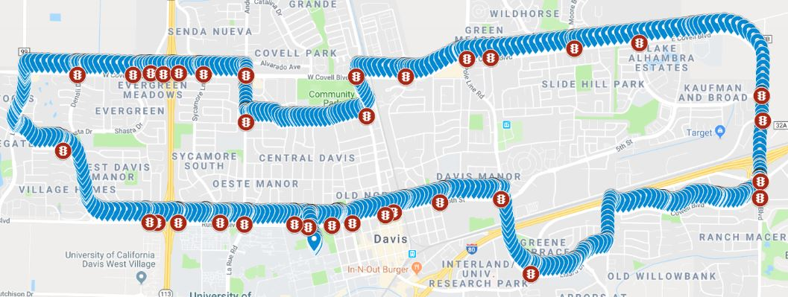

[Link to the repo](https://github.com/franklee97/emission-c3po)

<figure>
    
</figure>

## Introduction
This is a project I did with a transportation research group at UC Davis during my 4th year of undergraduate. I used a mathematical model produced by the California Air Resources Board(CARB) and real bus data from Unitrans to analyze the environmental effect of Traffic Signal Priority(TSP) on a bus. This was done by measuring the speed profile of a bus and using the EMFAC mathematical model to calculate the emission profile. My experiment showed around 5% decrease of emission with TSP.

## Background on TSP
Traffic Signal Priority is a way to give priority to certain cars at an intersection. Usually this is given to buses or other public transit to keep the flow of traffic much lighter. Although very sound, very few places actually have this mechanism implemented. There are many ongoing research to determine how effective TSP is. In the city of Davis, there are a couple of traffic lights that have the capability of implementing TSP, but because of the lack of interest by the city, they are all currently turned off. I believed that by providing a study on its effect in the environment, more cities will be willing to implement TSP.

## Method of measuring emission
Measuring emission directly from the bus was very difficult. There are a sensors meant to measure emission profile such as CO2, CO, NOx, HC, but because the exhaust fume is very concentrated, buying a sensor off the shelf was a difficult option. I turned to using a mathematical model instead. CARB created a software with a mathematical model to calculate the emission profile of a specific make/model of a vehicle that takes in a speed profile over a certain period of time as its input. [link to the tool](https://ww2.arb.ca.gov/our-work/programs/mobile-source-emissions-inventory/msei-modeling-tools) I decided to use this tool for my experiment. Because of CARB's extensive database, the tool had the exact make and model of the buses that are used at Unitrans. I decided to use a GPS-enabled microcontroller to log data throughout a bus's route to get a speed profile without TSP. Then, I would remove certain points of the data to mimic a TSP to get a new speed profile. Afterwards, I compared the emission profile results.

## Using GPS to log position data
I purchased an Arduino Uno and a GPS shield that will be used to log the position data of the bus. The GPS shield had the capability of recording the latitude and longitude to five digits after decimal points(~1m precision), which was precise enough for my experiment. I uploaded a code to Arduino that will log the GPS data every 3 seconds. I then left the Arduino collect data on the bus's dash for one hour while I drove one of the lines for Unitrans. This was done during one of my shifts as a bus driver. From the location data, I was able to calculate the speed data by taking the distance between two points and dividing by the difference in timestamp. This was done by a simple script that is in the Github repo above. A sample latitude/longitude and speed data is shown below.

<figure>
    
</figure>

## Integrating traffic light map
I reached out to the city of Davis to get a map of all the traffic lights in the city. I then plotted the traffic lights and the location data onto the same map through Google Maps. This is shown below.

<figure>
    
</figure>

## Mimicking TSP
Using the traffic lights data, I went through each traffic light location to remove the location points to mimic as if the bus had blown through the intersection without stopping. The picture below is a good example of a bus being stopped at a traffic light. 
<figure>
    
</figure>

To "remove" the points from the location data, I needed to shift up the latitude and longitude data while keeping the same timestamp. I calculated the speed profile again. The two speed profiles are shown below:
<figure>
    
</figure>

## Speed distribution change
In addition to the bus being idle for less amount of time, the average speed throughout the hour increased from 14mph to 16.3mph, and the route was completed 15 minutes earlier. I ran the two speed profiles through EMFAC tool. The output of this tool is an emission profile of the vehicle at a specific speed. Part of the emission result is shown below:
<figure>
    
</figure>

## Result calculations
To calculate the emission difference, I simply added up the entire column of "emission" and found that there was ~5% decrease in emission with TSP. This shows that experimentally, it proves that TSP can improve the environmental effect of vehicle emission. One of the drawbacks of this project is that the EMFAC model doesn't take in consideration of acceleration. Vehicles tend to spew out more emission while accelerating. However, unlike many research on this topic, my experiment was one of the few that had concrete experimental data. Unfortunately I had to stop this project as I graduated from school in June 2019, I hope to see more research done on this topic in the future.