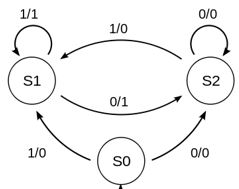

<figure>
    
</figure>

## Introduction
This is a project I did during my internship at Texas Instruments. As a Digital Design Engineer Intern, I was given the opportunity to work on a project that will be implemented in TI's new chip. Everything on this page just consists of my project and nothing specific to the chip. I used Verilog to design a new module that can be useful during the chip's post-fab debug scenarios.

## Purpose of my module
A typical chip contains numerous different Finite State Machines(FSM) working concurrently. Finite State Machine is a model of computation that is used in digital design. It processes a sequence of inputs that changes the state of the system. For example, there could be a Master FSM controlling the overall behavior of the chip, and once it changes state, the pulse from the Master FSM will kick off the relevant sub-FSMs to go through its cycle. Because FSMs show the behavior of the chip, capturing the history of the states can give a good insight of what is happening inside the chip. After the chip is manufactured, however, the number of signals the user can interact with becomes very limited. Unlike simulation, we can't monitor every single signal to debug. To remedy this problem, my module was created with the ability to detect the state changes internally, log the historical data in an internal memory per FSM module, and output the data to user on demand.

## Module behavior
Whenever my module detects a state change, it triggers the internal FIFO to push the name of the state. When a read signal is received, it triggers the FIFO to pop the data. In addition to the name of the state, the number of clock cycles that the chip resided in that state was also concatenated to the data and fed into the FIFO. There are also many different useful input signals and output flags that was implemented in the module. Please reach out to me to learn more about this project.

## Further steps after designing the module
I not only designed the module all by myself, but I also created testbench to mimic the behaviors of the module. This means that I wrote testcases for normal behavior as well as edge and corner cases. This was followed by checking my testbench for code coverage to check how much of the module's behavior was tested via my testbench. Lastly, I ran my code through a synthesis tool to ensure that it will be synthesizable and to observe the number of flops it uses.

## Reflection
Little did I know before the project, building a successful design requires extensive verification steps. The design isn't completed just after making the module. An amazing, intricate design cannot be implemented into a chip if no one decides to do design verification.