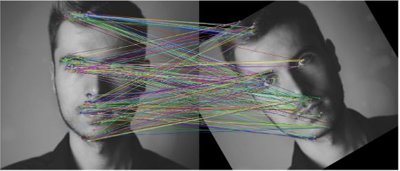

[Link to the repo](https://github.com/minhsqtruong/18-645-Semester-Project)

[Link to the final report]("../assets/projects/orb/18_645_Final_Report.pdf")

<figure>
    
</figure>

## Introduction
This is a final project of one of the classes I took during 2019 Fall semester at Carnegie Mellon University, How to Write Fast Code. The main objective of this course was to learn about performance coding. Given a piece of hardware, we learned how to get the most out of that hardware. For this project, we used CMU ECE department's NVidia Quadro P2000 as our hardware to efficiently implement ORB, a feature detection algorithm. The main goal of the project was to achieve as close to 100% of the peak performance. This was measured by comparing the arithmetic throughput of our kernel code to the actual throughput of our kernel implementation. We were able to get around 80% of peak performance.

## Background on ORB
ORB, or Oriented FAST and Rotated BRIEF, is a feature detection algorithm used in Computer Vision and is developed by Willow Garage. [Link to ORB research paper]("http://www.willowgarage.com/sites/default/files/orb_final.pdf") Given an image, ORB is able to figure out the keypoints -- an "interest" point. To give an example of its use case, think of a camera in a self driving car that takes in multiple frames per second. By comparing these frames, the car is able to reconstruct the environment it is in, which will help the car come up with the next move (ORB-SLAM). ORB is used to compare these frames. By matching the list of keypoints of one frame to the list of keypoints to the second frame, we can know that an object in first frame is the same object in the second frame. By utilizing this feature, we can be one step closer to autonomous vehicles. ORB is divided into oFAST and rBRIEF. oFAST is a keypoint detector that uses ring comparisons to deteminer whether or not the pixel is a keypoint. rBRIEF is a way to come up with a unique desciptor for each keypoint that will be useful during the matching process. If keypoint #53 from one frame has the same descriptor as keypoint #65 from second frame, we can conclude that they are the same object.

## My task in the project
Because we had three people in the group, we pipelined our tasks into oFAST, rBRIEF, and Matching. I was in charge of oFAST. To give a brief overview of my task, I came up with the code to do ring comparison using NVidia CUDA and utilized as many performance programming methods I learned from the course. Some of the methods I used are pre-computation hashmap, loop unrolling, using shared memory, and doing software pipelining. More detail can be found in the project paper.