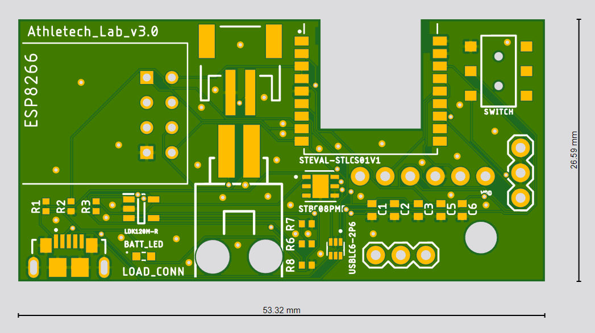
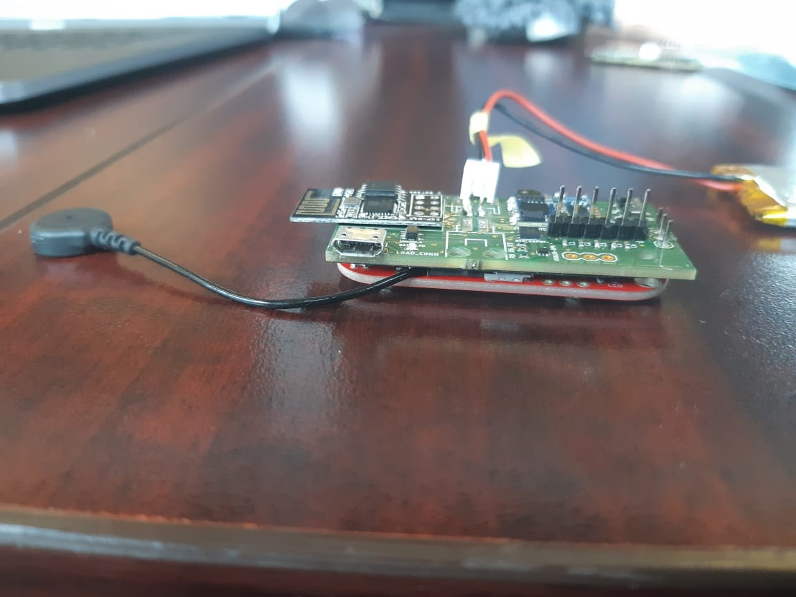

[Link to the repo](https://github.com/franklee97/Athletech)

<figure>
    
</figure>

## Introduction
This is a project I did at Carnegie Mellon under Professor Priya Narasimhan. Professor Priya is a well known scholar in the sports technology industry. Her startup, Yinzcam, was a spinoff from a research project she did at CMU, and now it has partnerships with hundreds of different sports clubs around the globe. This lab, Athletech, was founded by Professor Priya and couple of her students, including me. The lab's main focus is "Prescriptive analytics for sports performance." The lab has a close relationship with local professional sports team, who was able to provide the lab with access to their facilities. My role during my time there was a Hardware/Firmware lead of the group and helped create a prototype board that can measure biophysical traits in real-time to monitor an athlete's performance.

## Hardware
The hardware we used for the protype had the following features.
1. +- 16G accelerometer (ST SensorTile)
2. Magnetometer (ST SensorTile)
3. Gyroscope (ST SensorTile)
4. EMG sensor (Myoware Muscle Sensor)
5. Load(pressure) sensor (FSR Analog Sensor)
6. Wifi/Bluetooth capability (ESP8266 / ST SensorTile)
7. Toggleable switch
8. Lithium Ion Battery

## Firmware
Rather than using a commonly used Arduino, we decided to use STMicroelectronics' STM32 microcontroller because of their industry-level ARM processor. STM has an IDE that is based on Eclipse IDE called System Workbench for STM32 that is used to write low level C code for the microcontroller. The accelerometer/magnetometer/gyroscope were connected via SPI to the processor. The ESP8266 Wifi chip was connected via UART. In order to talk to the ESP8266 Wifi chip, we needed to send raw AT commands through the TX line of the UART. The endpoint of the Wifi communication was a local hub, which would parse the information to a Google Firebase database.

## PCB
I created a PCB design with these considerations. The PCB was designed using EAGLE.
<figure>
    
</figure>

## Assembly
<figure>
    
</figure>
<figure class="half">
    
    
</figure>

## Video demo
<iframe width="560" height="315" src="//www.youtube.com/embed/YsRt_t1d2y0" frameborder="0"> </iframe>
